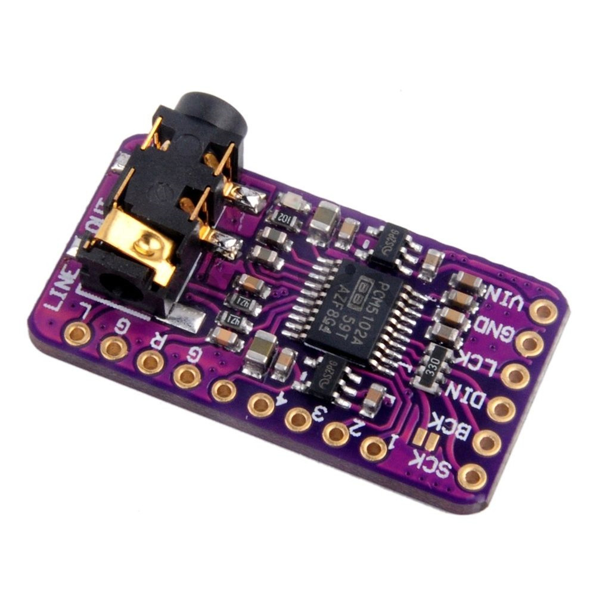
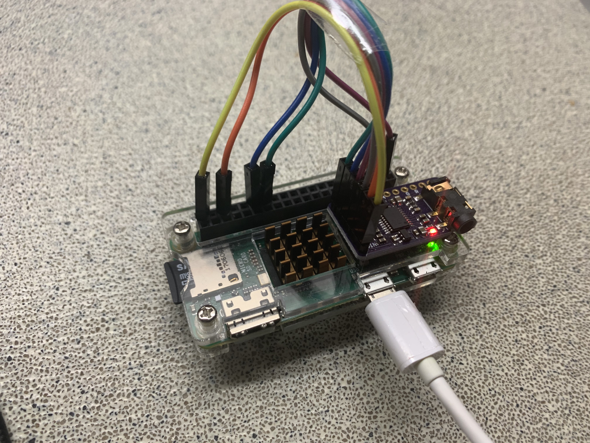

# Headless read-only raspberry-pi zero
The goal is to create a simple and robust raspberry installation for high-quality Spotify streaming.
A Raspberry PI zero is ideal as it runs Linux and can be equipped with a cheap, but relative high-quality DAC.
The ultimate goal will be to add this small device to a "dumb" speaker (e.g. a Tivoli One). But first things first, getting the Pi up-and-running...

Another consideration is the use of a read-only file-system This will reduce the risk of a faulty filesystem due to incorrect shutdowns.


For this project I used this external DAC, together with a Zero wireless and Debian Buster as distribution.
https://nl.aliexpress.com/item/33061919226.html\
or\


And here is the prototype built;
 


## Setup Spotify streaming (connect, assuming a fresh install
Prepare the distribution\
`sudo apt update && sudo apt upgrade`
`sudo apt install -y apt-transport-https curl`

Add the repository\
`curl -sSL https://dtcooper.github.io/raspotify/key.asc | sudo apt-key add -v -`
`echo 'deb https://dtcooper.github.io/raspotify raspotify main' | sudo tee /etc/apt/sources.list.d/raspotify.list`

Install raspotify\
`sudo apt update`
`sudo apt install raspotify`

Adjust config (bitrate 96 low, 160 normal, 320 high)\
`sudo nano /etc/default/raspotify`

Enable the service\
`sudo systemctl enable raspotify`
`sudo systemctl start raspotify`
`sudo systemctl restart raspotify`


##Enable the DAC, and disable the HDMI-soundcard
First add some tools to validate the install.\
`sudo apt-get install alsa-utils`

The DAC uses 5v, which can be sourced from the RPI connector.
SCK needs to be connected to ground, else there will be some noise on the output.

```DAC BOARD   > Raspberry Pi 3 Model B connector J8
-----------------------------------------------
SCK         > PIN x     (GND)
BCK         > PIN 12    (GPIO18)
DIN         > PIN 40    (GPIO21)
LRCK        > PIN 35    (GPIO19)
GND         > PIN 6     (GND)
VIN         > PIN 2     (5V)

-----------------------------------------------
FLT             > Not wired 
DEMP            > Not wired 
XSMT            > Not wired 
FMT             > Not wired 
A3V3            > Not wired 
AGND            > Not wired (Same as headphone out) 
ROUT            > Not wired (Same as headphone out)
AGNDL           > Not wired (Same as headphone out)
LROUT           > Not wired (Same as headphone out)
```

The boot.txt should be adjusted with an overlay
`sudo nano /boot/config.txt`


```
# Uncomment some or all of these to enable the optional hardware interfaces
#dtparam=i2c_arm=on
#dtparam=i2s=on
#dtparam=spi=on

# Enable audio (loads snd_bcm2835)
#dtparam=audio=on      # We only want the external DAC
dtoverlay=hifiberry-dac
```


Add an asound.conf 

`vi /etc/asound.conf`

```
pcm.!default {
  type hw card 0
}
ctl.!default {
  type hw card 0
}
```


## Validate the install
Reboot / reload the PI and check if all is working correctly\
See if the DAC is enabled `$ aplay -l`;

```
pi@zero1:~ $ aplay -l
**** List of PLAYBACK Hardware Devices ****
card 0: sndrpihifiberry [snd_rpi_hifiberry_dac], device 0: HifiBerry DAC HiFi pcm5102a-hifi-0 [HifiBerry DAC HiFi pcm5102a-hifi-0]
  Subdevices: 1/1
  Subdevice #0: subdevice #0
```
Success!


## Preparations for read-only filesystem
First things first, prepare the installation. for a read-only operation by removing most of the unwanted software.

##### Enable Filesystem (TMPFS)
Write to RAM instead of the SDCARD

`$ sudo vi /etc/fstab`

```
tmpfs    /tmp               tmpfs   defaults,noatime,nosuid,size=30m                    0 0
tmpfs    /var/tmp           tmpfs   defaults,noatime,nosuid,size=30m                    0 0
tmpfs    /var/log           tmpfs   defaults,noatime,nosuid,mode=0755,size=30m          0 0
tmpfs    /var/run           tmpfs   defaults,noatime,nosuid,size=30m                    0 0
tmpfs    /var/spool         tmpfs   defaults,noatime,nosuid,size=30m                    0 0
tmpfs    /var/spool/mqueue  tmpfs   defaults,noatime,nosuid,mode=0700,gid=1001,size=30m 0 0
tmpfs    /var/lock          tmpfs   defaults,noatime,nosuid,size=30m                    0 0
```

##### Fix DHCP and resolve.conf
Needed because this is dynamical created.

```$ sudo rm -rf /var/lib/dhcp /var/lib/dhcpcd5 /etc/resolv.conf
$ sudo ln -s /tmp /var/lib/dhcp
$ sudo ln -s /tmp /var/lib/dhcpcd5
$ sudo touch /tmp/dhcpcd.resolv.conf
$ sudo ln -s /tmp/dhcpcd.resolv.conf /etc/resolv.conf
```


##### Log in to your Raspberry via SSH. I recommend you first update your Pi one more time to get all the latest software packages:
`$ sudo apt-get update && apt-get upgrade`
##### Afterwards do a little housekeeping and remove the following packages. If these were not installed in the first place then just skip this step:
`$ sudo apt-getremove --purge wolfram-engine triggerhappy anacron logrotate dphys-swapfile xserver-common lightdm`
##### Stop the X11 server (if running):
`$ sudo systemctl disable x11-common`
##### Clean up your packages:
`$ sudo apt-get autoremove --purge`
##### Remove some startup scripts
`$ sudo systemctl disable bootlogs`
`$ sudo systemctl disable console-setup`


##### Replace your log manager to one which logs to memory
`$ sudo apt-get install busybox-syslogd`
`$ sudo dpkg --purge rsyslog`


## Disable swap and filesystem check and set it to read-only
Edit the file `$ sudo vi /boot/cmdline.txt` and add the following three words at the end of the line: `fastboot noswap ro`

_Example:_\
`dwc_otg.lpm_enable=0 console=tty1 root=/dev/mmcblk0p2 rootfstype=ext4 elevator=deadline rootwait fastboot noswap ro`


##### Update the systemd random seed
Link the random-seed file to the tmpfs location:\
`$ sudo rm /var/lib/systemd/random-seed`
`$ sudo ln -s /tmp/random-seed /var/lib/systemd/random-seed`

And update the daemon configuration file\
`$ sudo vi /lib/systemd/system/systemd-random-seed.service`

```
[Service]
Type=oneshot
RemainAfterExit=yes
ExecStartPre=/bin/echo "" >/tmp/random-seed
ExecStart=/lib/systemd/systemd-random-seed load
ExecStop=/lib/systemd/systemd-random-seed save
TimeoutSec=30s
```


#### reboot system to check if all still works
After this successful test the filesystem can be made read-only\
Update the file /etc/fstab and add the ,ro flag to all block devices

_Example_:
```
proc            /proc           proc    defaults             0       0
/dev/mmcblk0p1  /boot           vfat    defaults,ro          0       2
/dev/mmcblk0p2  /               ext4    defaults,noatime,ro  0       1
```


### remounting
If you need to make adjustments, the filesystem can be remounted read-write\
`sudo mount -o remount,rw /`
